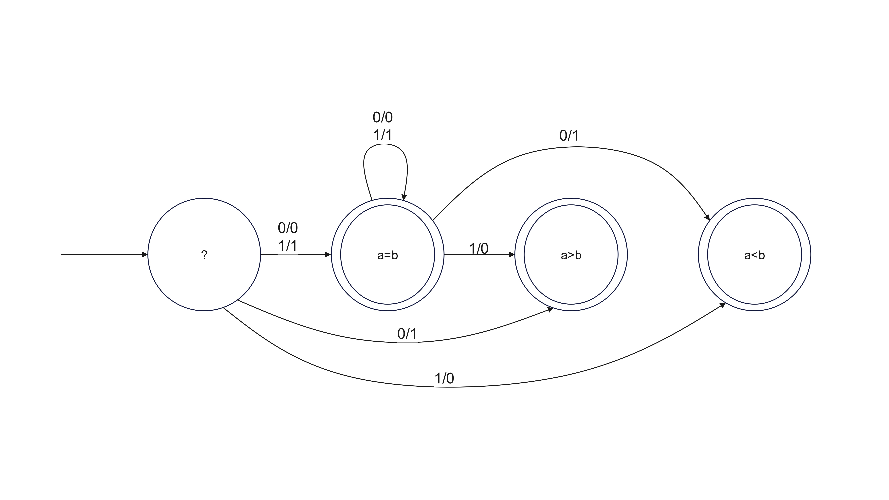

# How min(a, b) and max(a, b) calculated in computer systems?
As you know, max and min are functions commonly used in many programs. How do these functions operate efficiently? Using the min and max formulas is the first approach that comes to mind: 

$$max(a, b) = \frac{(a+b) + |a-b|}{2}$$

$$min(a, b) = \frac{(a+b) - |a-b|}{2}$$

You may think of these functions as a proper solution. In terms of computer architecture, these functions require many clock cycles to compute the desired result. Hence, computers compute min and max differently. If we have a = 5 and b = 2, and an 8-bit 2's complement system:  

  a = (5)10 = (00000101)2

  a = (2)10 = (00000010)2

The CPU starts from the most left-hand bit (the most significant bit or MSB) and compares them. The corresponding FSA diagram is shown below:

The verilog implementation of this idea is in <a href="./https://github.com/mosaleh2078/how-min-max-calculated/blob/main/2's%20Complement%20Comparator.sv">this file</a>
